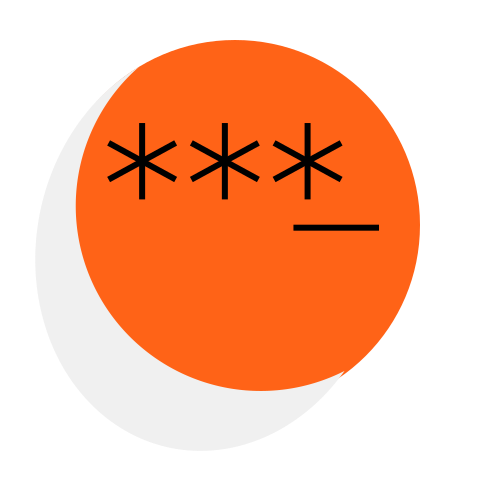
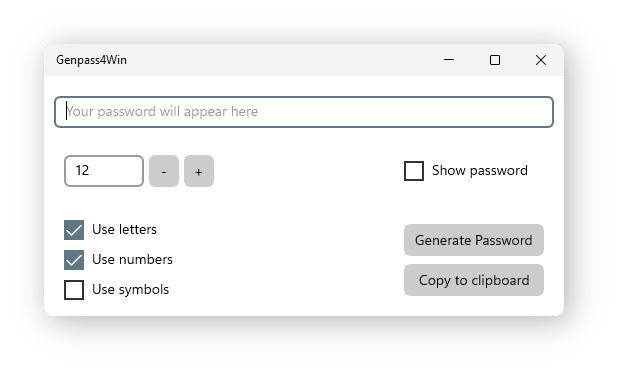

<h1 align="center">
	 
	Genpass4Win
</h1>

	
	
	
	

This program is a password generator for Windows systems built using the
[Universal Windows Platform](https://docs.microsoft.com/en-us/windows/uwp/get-started/universal-application-platform-guide),
which allows for the creation of a GUI that integrates seamlessly with the system theme, wether its
light or dark.

<h2 align="center">How to use</h2>

The GUI is pretty simple, with just a few buttons and checkboxes.

There is a password length selector, identifiable as the box with **+** and **-** right beside it.
You can write a number into this box or use the **+** and **-** buttons. (If you type an invalid
number or letters, the value will be set back to what it was next time you generate a password).

There is a group of 3 checkboxes to control if you want **letters**, **numbers** and/or **symbols**
in your password.

Last, but not least, there are two buttons on the bottom right corner, the upper one to generate
the password, and the bottom one to copy it to the clipboard.

Above the **generate password** button there is a checkbox to control if the generated password is
hidden or visible.

<h2 align="center">How to install the project</h2>

At least for now, I don't have a way to provide an easy installation without you building
the program yourself, for which you will need some resources preinstalled. Specifically, you'll
need [Visual Studio](https://visualstudio.microsoft.com/), and the Universal Windows Platform
development kit (If you install Visual Studio it should prompt you to select it for installation)
which weighs about 11GB.

If you know how to use Visual Studio, you should be able to build and publish the program without
too much hastle. Here are some useful resources:
- [What's a Universal Windows Platform (UWP) app?](https://docs.microsoft.com/en-us/windows/uwp/get-started/universal-application-platform-guide)
- [How to package a UWP app in Visual Studio](https://docs.microsoft.com/en-us/windows/msix/package/packaging-uwp-apps)

<h2 align="center">About</h2>

This program, repository, and the contributions to this repository are under the
[MIT License](LICENSE) (SPDX license identifier: MIT).
